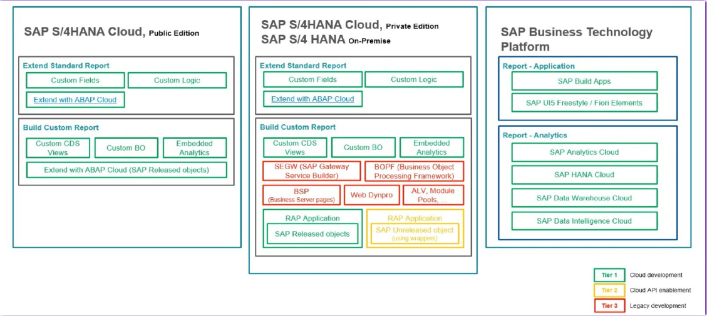
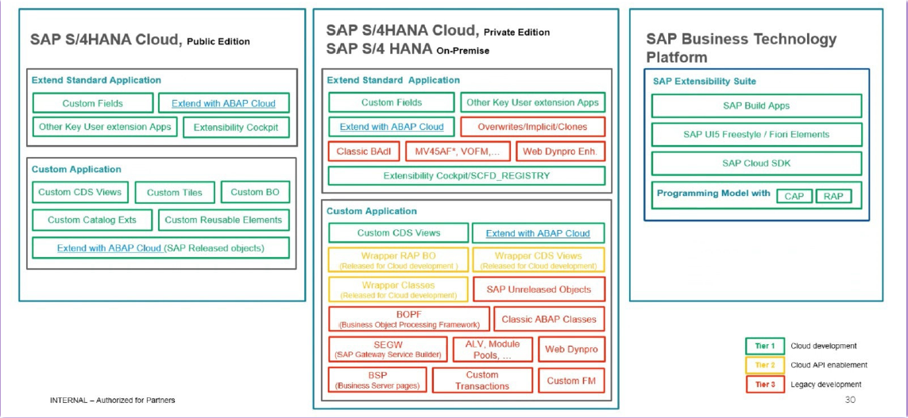

# Cartilha SAP Clean Core para Desenvolvedores

## 1. Introdução ao Clean Core

### Conceito Principal
- **Clean Core**: Manter o sistema core limpo, reduzindo customizações e garantindo estabilidade nas atualizações
- **Objetivo**: Separar desenvolvimentos customizados do código SAP standard
- **Benefício**: Sistema upgrade-stable e cloud-ready

### Princípios Fundamentais
- Usar apenas APIs Released
- Evitar modificações diretas no standard
- Adotar modelo de desenvolvimento ABAP Cloud quando possível

---

## 2. Modelo de TIERs - Classificação de Objetos

### TIER 1 - Cloud Development (Clean Core)
- **Características**: 
  - Desenvolvimento 100% ABAP Cloud
  - Usa apenas APIs Released
- **Exemplos**: RAP, CDS Views Released, BAdIs Released

### TIER 2 - Cloud API Enablement (Wrappers)
- **Características**:
  - Cria wrappers para APIs não-released
  - Wrapper é released para uso em TIER 1
- **Exemplos**: Wrapper para BAPI, Wrapper para tabelas

### TIER 3 - Classic ABAP Extensions
- **Características**:
  - ABAP clássico sem restrições
  - Maior risco em upgrades
  - Usar apenas quando TIER 1/2 não são viáveis
- **Exemplos**: User Exits, Enhancement Points, Modificações

### Tipos de Desenvolvimento e Clasificação das Ferramentas/Frameworks

#### Report


#### Interface


#### Enhancements


---

## 3. ABAP Standard vs ABAP Cloud

| Aspecto | ABAP Standard | ABAP Cloud |
|---------|---------------|------------|
| **Sintaxe** | Completa, sem restrições | Restrita, apenas subset aprovado |
| **APIs** | Acesso a todos objetos | Apenas Released APIs |
| **IDE** | SE80, ADT | Apenas ADT (Eclipse) |
| **Modelo** | Qualquer | RAP preferencialmente |
| **Upgrade** | Risco de quebra | Upgrade-stable |

### Principais Restrições ABAP Cloud
- Sem `CALL FUNCTION ... STARTING NEW TASK`
- Sem `ENHANCEMENT-POINT`
- Sem acesso direto a tabelas standard
- Sem uso de objetos não-released

---

## 4. Determinação do Contrato dos Objetos

### Release Contracts
- **C0**: Uso interno SAP apenas
- **C1**: Released para Cloud Development
- **C2**: Released com restrições
- **Deprecated**: Objeto descontinuado (buscar sucessor)

### Como Verificar
1. **No ADT**: Properties → API State
2. **No sistema**: Verificar atributo de release
3. **Cloudification Repository**: Lista completa de objetos

---

## 5. Utilização de Objetos ABAP Standard em Cloud

### Processo de Análise
1. Verificar se existe versão Released do objeto
2. Se não existe, avaliar criação de wrapper (TIER 2)
3. Documentar dependências para futura migração

### Alternativas para Objetos Comuns
- **Tabela Standard** → CDS View Released
- **BAPI** → RAP BO Interface
- **Function Module** → Classe/Método Released

---

## 6. Construção de Wrappers (TIER 2)

### Wrapper para BAPI/Function Module com Factory

```abap
" Interface do Wrapper (Released C1)
INTERFACE zif_wrapper_bapi PUBLIC.
  TYPES: tt_return TYPE TABLE OF bapiret2.
  METHODS: execute_bapi
    IMPORTING iv_param TYPE string
    RETURNING VALUE(rt_return) TYPE tt_return.
ENDINTERFACE.

" Interface Factory (Released C1)
INTERFACE zif_wrapper_factory PUBLIC.
  CLASS-METHODS: create_instance
    RETURNING VALUE(ro_instance) TYPE REF TO zif_wrapper_bapi.
ENDINTERFACE.

" Classe Wrapper (implementação privada)
CLASS zcl_wrapper_bapi DEFINITION PUBLIC FINAL
  CREATE PRIVATE
  GLOBAL FRIENDS zcl_wrapper_factory.
  
  PUBLIC SECTION.
    INTERFACES: zif_wrapper_bapi.
    
  PRIVATE SECTION.
    " Implementação chama BAPI não-released
ENDCLASS.

" Classe Factory (Released C1)
CLASS zcl_wrapper_factory DEFINITION PUBLIC FINAL
  CREATE PUBLIC.
  
  PUBLIC SECTION.
    INTERFACES: zif_wrapper_factory.
    
  PRIVATE SECTION.
    " Cria instância da classe wrapper
ENDCLASS.
```

Para geração automática do wrapper pode ser utilizada a transação ACO_PROXY.

### Wrapper para Tabelas

```abap
" CDS View Wrapper (Released)
@AccessControl.authorizationCheck: #CHECK
define view entity ZI_TableWrapper 
  as select from standard_table
{
  key field1,
      field2
}
```

### Passos para Criar Wrapper com Factory
1. Criar em Software Component Standard ABAP (TIER 2)
2. Definir interface do wrapper (TIER 1)
3. Definir interface factory (TIER 1)  
4. Implementar classe wrapper com CREATE PRIVATE (TIER 2)
5. Implementar classe factory que cria instâncias (TIER 2)
6. Marcar factory como C1-Released

---

## 7. BADIs e Enhancement Implícitos

### BADIs Released
- Usar preferencialmente BADIs Released
- Implementar via ADT ou Key User Extensibility

### BADIs Não-Released (TIER 3)
- Avaliar probabilidade de release futuro
- Documentar uso para análise em upgrades
- Não adicionar logica de negocio.
- Implementar logica de negocio no TIER 1.

### Enhancement Points Implicitos e Modificações
- **Implicit**:
  - Utilizar em ultima instancia.
  - Não adicionar logica de negocio. 
  - Implementar logica de negocio no TIER 1.
- **Modificações**: Nunca usar

---

## 8. Implementação TIER 3

### Quando Usar
- Funcionalidade não coberta por APIs Released
- Interfaces SAP GUI legadas
- Requisitos urgentes sem alternativa

### Boas Práticas
- Documentar motivo do uso
- Planejar migração futura
- Isolar em pacote específico

---

## 9. Organização em Pacotes

### Estrutura Recomendada
```
Z_TIER1                      (Software Component: Cloud)
├── Z_TIER1_SOLUCAO_A_T1       
└── Z_TIER1_SOLUCAO_B_T1       

Z_TIER2                      (Software Component: Standard ABAP)
├── Z_TIER2_SOLUCAO_A_T2       
└── Z_TIER2_SOLUCAO_B_T2       

Z_TIER3                      (Software Component: Standard ABAP)
├── Z_TIER3_SOLUCAO_A_T3       
└── Z_TIER3_SOLUCAO_B_T3       
```

### Regras de Organização
- **Separação por TIER primeiro**: Não é possível misturar Software Components numa mesma hierarquia de pacotes.
- **Depois por solução**: Dentro de cada TIER, organizar por módulo/solução
- **Isolamento claro**: Cada TIER em seu próprio Software Component

---

## 10. Busca de Objetos Released

### SAP Business Accelerator Hub
- **URL**: https://api.sap.com
- **Conteúdo**: APIs, Events, CDS Views, BAdIs, BOInterfaces
- **Filtros**: Por módulo, tipo, versão

### Fiori Apps
- **View Browser**: 
  - Busca de CDS Views (com status Released).
- **Custom Fields and Logic** (User Extensibility):
  - Extensão de entidades com campos custom.
  - Extensão de regras de negocio com logica custom.

### Cloudification Repository Viewer (CRV)
- **Ferramenta**: https://software-heroes.com/en/cloudification-repository-viewer
- **Documentação**: https://software-heroes.com/en/crv-documentation
- **Conteúdo**: Lista completa de objetos Released, Classic APIs, Deprecated
- **Formato**: Interface web para consulta de objetos e seus sucessores

---

## 11. Instalação Eclipse + ADT

### Pré-requisitos
- Java 21 (Oracle ou SAP Machine)
- SAP GUI 7.80+ (para integração)
- Acesso ao sistema SAP (7.51+)

### Passos de Instalação

1. **Baixar Eclipse**
   - https://www.eclipse.org/downloads/
   - Escolher "Eclipse IDE for Java Developers"

2. **Instalar ADT Plugin**
   - Help → Install New Software
   - URL: https://tools.hana.ondemand.com/latest
   - Selecionar "ABAP Development Tools"

3. **Configurar Conexão**
   - File → New → ABAP Project
   - Selecionar sistema do SAP Logon
   - Informar credenciais

### Tutorial Completo
- https://developers.sap.com/tutorials/abap-install-adt.html

---

## 12. Exercícios Práticos

### Exercício 1: Identificação de TIERs
- Analisar código existente
- Classificar objetos por TIER
- Propor plano de migração

### Exercício 2: Criar Wrapper Simples
- Escolher BAPI não-released
- Implementar wrapper classe/interface
- Marcar como Released
- Testar consumo em TIER 1

### Exercício 3: Buscar APIs Released
- Encontrar substituto para tabela standard
- Localizar BAdI Released para processo
- Identificar CDS View para relatório
- Identificar BOInterface para operação transacional

### Exercício 4: Enhancement Implicito: TIER 3 → TIER 1
- Identificar enhancement point
- Encapsular logica de negócio em classe do TIER 1
- Realizar a chamada da classe desde o enhancement point

---

## 13. Links de Referência e Tutoriais

### Documentação Oficial
- [ABAP Cloud Documentation](https://help.sap.com/docs/abap-cloud)
- [Clean Core Overview](https://www.sap.com/products/technology-platform/clean-core.html)
- [ABAP Extensibility Guide](https://www.sap.com/documents/2024/08/clean-core-extensibility.html)

### Tutoriais Práticos
- [Tutorial: Criar Wrapper para BAPI](https://developers.sap.com/tutorials/abap-s4hanacloud-purchasereq-create-wrapper.html)
- [Tutorial: Instalar ADT](https://developers.sap.com/tutorials/abap-install-adt.html)
- [Tutorial: Criar Projeto ABAP](https://developers.sap.com/tutorials/abap-create-project.html)
- [Learning Journey: Clean Core Extensibility](https://learning.sap.com/learning-journeys/practicing-clean-core-extensibility-for-sap-s-4hana-cloud)

### Blogs e Artigos
- [3-Tier Model Explained](https://blog.maruskin.eu/2024/08/3-tier-model-to-get-to-abap-cloud.html)
- [ABAP Cloud FAQ](https://pages.community.sap.com/topics/abap/abap-cloud-faq)
- [Cloud Ready RAP with Legacy BAPI](https://community.sap.com/t5/technology-blogs/cloud-ready-rap-object-using-legacy-bapi/ba-p/13572339)
- [Classic APIs for Tier 2](https://community.sap.com/t5/technology-blogs/classic-apis-for-tier-2-abap-cloud/ba-p/13620329)

### Ferramentas e Recursos
- [SAP Business Accelerator Hub](https://api.sap.com)
- [ABAP Cheat Sheets](https://github.com/SAP-samples/abap-cheat-sheets)
- [Cloudification Repository Viewer (CRV)](https://software-heroes.com/en/cloudification-repository-viewer)
- [CRV Documentation](https://software-heroes.com/en/crv-documentation)
- [Eclipse Download](https://www.eclipse.org/downloads/)
- [ADT Tools](https://tools.hana.ondemand.com/)

### Vídeos e Webinars
- [Clean Core Extensibility Webinar](https://community.sap.com/t5/devtoberfest/clean-core-extensibility-with-abap-cloud/ev-p/13803158)
- [Developing for Clean Core](https://community.sap.com/t5/devtoberfest/developing-and-transforming-your-abap-custom-code/ev-p/13806640)
